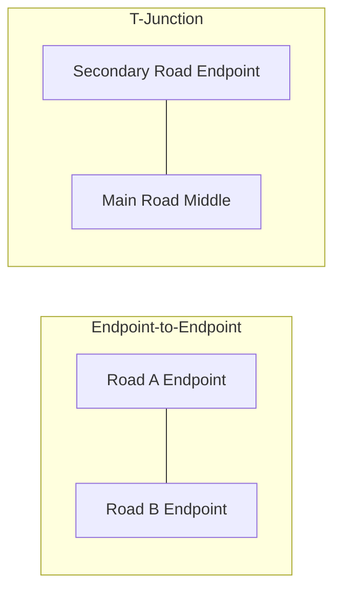
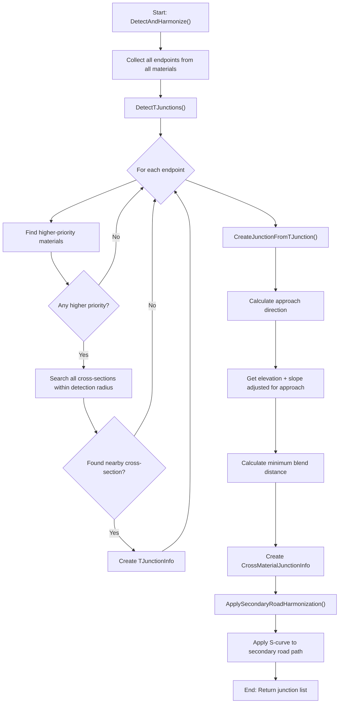

# Cross-Material Junction Detection: A Comprehensive Guide

## Overview

The `CrossMaterialJunctionDetector` class handles the detection and harmonization of road junctions where roads from different material layers meet. This is critical for creating seamless terrain transitions in BeamNG maps where, for example, an asphalt highway meets a gravel side road.

## Key Concepts

### Material Priority System

Roads are assigned **material indices** where higher indices indicate higher priority:

```
Material Index 0: Dirt road (lowest priority)
Material Index 1: Gravel road
Material Index 2: Asphalt highway (highest priority)
```

**Rule**: Secondary roads (lower priority) adapt their elevation to match the main road (higher priority). The main road remains unchanged.

### Two Junction Types



1. **Endpoint-to-Endpoint**: Two road endpoints meet at nearly the same location
2. **T-Junction**: A secondary road endpoint meets the *middle* of a main road

---

## T-Junction Detection Algorithm

### Step 1: Collect All Road Endpoints

First, the algorithm collects endpoints from all material layers:

```csharp
private static List<JunctionEndpointInfo> CollectAllEndpoints(List<MaterialRoadData> allMaterialData)
{
    var allEndpoints = new List<JunctionEndpointInfo>();

    foreach (var data in allMaterialData)
    {
        // Group cross-sections by path ID
        var pathGroups = data.Geometry.CrossSections
            .Where(cs => !cs.IsExcluded && !float.IsNaN(cs.TargetElevation))
            .GroupBy(cs => cs.PathId)
            .ToList();

        foreach (var group in pathGroups)
        {
            var ordered = group.OrderBy(cs => cs.LocalIndex).ToList();
            
            // First endpoint of path
            var firstCs = ordered[0];
            allEndpoints.Add(new JunctionEndpointInfo
            {
                MaterialIndex = data.MaterialIndex,
                MaterialName = data.Material.MaterialName,
                CrossSection = firstCs,
                PathId = firstCs.PathId,
                IsPathTermination = true,
                OriginalElevation = GetOriginalElevation(firstCs),
                LocalSlope = CalculateLocalSlope(ordered, 0, isStartOfPath: true),
                // ... other properties
            });
            
            // Last endpoint of path (if different)
            if (ordered.Count > 1)
            {
                var lastCs = ordered[^1];
                allEndpoints.Add(new JunctionEndpointInfo
                {
                    MaterialIndex = data.MaterialIndex,
                    CrossSection = lastCs,
                    IsPathTermination = true,
                    LocalSlope = CalculateLocalSlope(ordered, ordered.Count - 1, isStartOfPath: false),
                    // ...
                });
            }
        }
    }

    return allEndpoints;
}
```

### Step 2: Detect T-Junctions

The core T-junction detection checks each endpoint against ALL cross-sections of higher-priority roads:

```csharp
private List<TJunctionInfo> DetectTJunctions(
    List<JunctionEndpointInfo> allEndpoints,
    List<MaterialRoadData> allMaterialData,
    float detectionRadius)
{
    var tJunctions = new List<TJunctionInfo>();

    foreach (var endpoint in allEndpoints)
    {
        // Only check against HIGHER priority materials
        var higherPriorityMaterials = allMaterialData
            .Where(m => m.MaterialIndex > endpoint.MaterialIndex)
            .ToList();

        if (higherPriorityMaterials.Count == 0)
            continue; // This is already the highest priority

        // Find nearest cross-section on any higher-priority road
        CrossSection? nearestCs = null;
        MaterialRoadData? nearestMaterial = null;
        float nearestDistance = float.MaxValue;

        foreach (var material in higherPriorityMaterials)
        {
            foreach (var cs in material.Geometry.CrossSections)
            {
                if (cs.IsExcluded || float.IsNaN(cs.TargetElevation))
                    continue;

                // Calculate 2D distance between endpoint and cross-section
                var dist = Vector2.Distance(
                    endpoint.CrossSection.CenterPoint, 
                    cs.CenterPoint);
                
                if (dist < nearestDistance && dist <= detectionRadius)
                {
                    nearestDistance = dist;
                    nearestCs = cs;
                    nearestMaterial = material;
                }
            }
        }

        // If found nearby higher-priority road → T-junction detected!
        if (nearestCs != null && nearestMaterial != null)
        {
            tJunctions.Add(new TJunctionInfo
            {
                SecondaryEndpoint = endpoint,
                MainRoadCrossSection = nearestCs,
                MainRoadMaterial = nearestMaterial,
                Distance = nearestDistance
            });
        }
    }

    return tJunctions;
}
```

### Visual Representation of T-Junction Detection

```
Detection Radius Circle
         ╭───────────╮
        ╱             ╲
       │   ●──────────┼────────● Main Road (Priority 2)
        ╲      ↑      ╱
         ╰─────┼─────╯
               │
               │  Secondary Road
               │  (Priority 1)
               ●
           Endpoint
```

The secondary road endpoint falls within the detection radius of a main road cross-section, triggering T-junction detection.

---

## T-Junction Creation and Slope Calculation

### Step 3: Create Junction with Slope-Aware Elevation

When a T-junction is detected, the algorithm must:
1. Get the **exact elevation** at the connection point on the main road
2. Calculate the **slope direction** relative to how the secondary road approaches

```csharp
private CrossMaterialJunctionInfo? CreateJunctionFromTJunction(
    TJunctionInfo tJunction,
    List<MaterialRoadData> allMaterialData,
    float defaultBlendDistance)
{
    var secondaryEndpoint = tJunction.SecondaryEndpoint;
    var mainCs = tJunction.MainRoadCrossSection;
    var mainMaterial = tJunction.MainRoadMaterial;

    // Connection point is ON the main road
    var connectionPoint = mainCs.CenterPoint;

    // Calculate approach direction: FROM secondary road TOWARD junction
    var approachDirection = Vector2.Normalize(
        connectionPoint - secondaryEndpoint.CrossSection.CenterPoint);
    
    // Get elevation and slope ADJUSTED for approach direction
    var (connectionElevation, connectionSlopeDegrees) = 
        GetElevationAndSlopeRelativeToApproach(
            mainCs, 
            mainMaterial.Geometry, 
            approachDirection);

    // Calculate minimum required blend distance
    var elevationDiff = MathF.Abs(
        secondaryEndpoint.OriginalElevation - connectionElevation);
    
    var minRequiredBlend = _elevationCalculator.CalculateMinimumBlendDistance(
        elevationDiff, 
        strictestMaxSlope, 
        connectionSlopeDegrees);

    return new CrossMaterialJunctionInfo
    {
        Position = connectionPoint,
        HarmonizedElevation = connectionElevation,
        DominantMaterialIndex = mainMaterial.MaterialIndex,
        BlendDistance = MathF.Max(defaultBlendDistance, minRequiredBlend),
        DominantRoadSlopeDegrees = connectionSlopeDegrees
    };
}
```

### Critical: Slope Direction Adjustment

The slope sign must be adjusted based on how the secondary road approaches the main road:

```csharp
private static (float elevation, float slopeDegrees) GetElevationAndSlopeRelativeToApproach(
    CrossSection crossSection,
    RoadGeometry geometry,
    Vector2 secondaryApproachDirection)
{
    var elevation = crossSection.TargetElevation;

    // Find neighboring cross-sections on the same path
    var pathSections = geometry.CrossSections
        .Where(cs => cs.PathId == crossSection.PathId && !cs.IsExcluded)
        .OrderBy(cs => cs.LocalIndex)
        .ToList();

    var index = pathSections.FindIndex(cs => cs.Index == crossSection.Index);
    
    // Calculate slope using neighbors
    int prevIdx = Math.Max(0, index - 1);
    int nextIdx = Math.Min(pathSections.Count - 1, index + 1);
    
    var cs1 = pathSections[prevIdx];
    var cs2 = pathSections[nextIdx];
    var distance = Vector2.Distance(cs1.CenterPoint, cs2.CenterPoint);
    
    var elevDiff = cs2.TargetElevation - cs1.TargetElevation;
    var slopeDegrees = MathF.Atan(elevDiff / distance) * 180f / MathF.PI;
    
    // Get main road direction
    var mainRoadDirection = Vector2.Normalize(cs2.CenterPoint - cs1.CenterPoint);
    
    // KEY FIX: Adjust slope sign based on approach direction
    var dot = Vector2.Dot(mainRoadDirection, secondaryApproachDirection);
    
    // If approaching from opposite direction, flip slope
    if (dot < 0)
    {
        slopeDegrees = -slopeDegrees;
    }

    return (elevation, slopeDegrees);
}
```

**Why this matters:**

```
Case 1: Secondary approaches in SAME direction as main road flow
        Main road goes uphill → Secondary sees "uphill" (positive slope)

Case 2: Secondary approaches in OPPOSITE direction  
        Main road goes uphill → Secondary sees "downhill" (negative slope)

        Main Road Direction →
        ════════════════════════► (going uphill)
                    │
                    ↓ Secondary approaches from opposite side
                    │ Must flip slope sign!
```

---

## Elevation Profile Application (S-Curve)

### Step 4: Apply Quintic Hermite S-Curve to Secondary Road

The secondary road's elevation is modified using a smooth S-curve:

```csharp
private int ApplyElevationProfileToPath(
    JunctionEndpointInfo endpoint,
    MaterialRoadData materialData,
    CrossMaterialJunctionInfo junction,
    float maxSlopeTan,
    float junctionSlopeTan)
{
    var pathSections = materialData.Geometry.CrossSections
        .Where(cs => cs.PathId == endpoint.PathId && !cs.IsExcluded)
        .OrderBy(cs => cs.LocalIndex)
        .ToList();

    // Determine if endpoint is at start or end of path
    var isStartOfPath = endpoint.CrossSection.LocalIndex == pathSections[0].LocalIndex;

    // Calculate cumulative distances from endpoint
    var distances = CalculateCumulativeDistancesFromEndpoint(pathSections, isStartOfPath);

    // Store ORIGINAL elevations (before any harmonization)
    var originalElevations = pathSections
        .Select(cs => GetOriginalElevation(cs))
        .ToArray();

    // Find original elevation at blend distance
    var originalElevationAtBlendEnd = FindOriginalElevationAtDistance(
        originalElevations, distances, isStartOfPath, 
        junction.BlendDistance, pathSections.Count);

    int modifiedCount = 0;
    float? previousNewElevation = null;
    var blendEndEaseZone = junction.BlendDistance * 0.15f; // 15% ease zone

    for (var i = 0; i < pathSections.Count; i++)
    {
        var idx = isStartOfPath ? i : pathSections.Count - 1 - i;
        var cs = pathSections[idx];
        var distFromEndpoint = distances[idx];

        if (distFromEndpoint > junction.BlendDistance + blendEndEaseZone)
            break;

        float newElevation;

        if (distFromEndpoint < 0.01f)
        {
            // At junction point → exact junction elevation
            newElevation = junction.HarmonizedElevation;
        }
        else if (distFromEndpoint <= junction.BlendDistance)
        {
            // Within blend zone → Quintic Hermite S-curve
            newElevation = _elevationCalculator.CalculateElevation(
                distFromEndpoint,
                junction.BlendDistance,
                junction.HarmonizedElevation,      // Start elevation
                originalElevationAtBlendEnd,       // End elevation
                junctionSlopeTan);                 // Junction slope
        }
        else
        {
            // Ease-out zone → smooth transition to original
            var easeT = (distFromEndpoint - junction.BlendDistance) / blendEndEaseZone;
            var smoothT = easeT * easeT * (3f - 2f * easeT); // Cubic smoothstep
            newElevation = originalElevationAtBlendEnd * (1f - smoothT) 
                         + originalElevations[idx] * smoothT;
        }

        // Apply consecutive slope clamping for safety
        if (previousNewElevation.HasValue && i > 0)
        {
            var prevIdx = isStartOfPath ? idx - 1 : idx + 1;
            var segmentDist = MathF.Abs(distances[idx] - distances[prevIdx]);
            
            newElevation = _elevationCalculator.ClampToMaxSlope(
                newElevation,
                previousNewElevation.Value,
                segmentDist,
                maxSlopeTan);
        }

        cs.TargetElevation = newElevation;
        modifiedCount++;
        previousNewElevation = cs.TargetElevation;
    }

    return modifiedCount;
}
```

### Elevation Profile Visualization

```
Elevation
    ↑
    │                              ╭─────── Original secondary road
    │                         ╭───╯
    │                    ╭───╯
    │               ╭───╯
    │          ╭───╯
    │     ╭───╯ ← Ease-out zone (15%)
    │╭───╯
    ├────────────────┬─────────────────→ Distance from junction
    │                │
    │   S-curve      │   Blend Distance
    │   blend zone   │
    ├────────────────┤
    Junction         Blend End
    Elevation
```

---

## Complete Detection Flow



---

## Configuration Parameters

The detection behavior is controlled by `JunctionHarmonizationParameters`:

| Parameter | Default | Description |
|-----------|---------|-------------|
| `JunctionDetectionRadiusMeters` | 10.0m | Maximum distance to detect T-junctions |
| `JunctionBlendDistanceMeters` | 30.0m | Default S-curve blend distance |
| `MaxTransitionSlopeDegrees` | 8.0° | Maximum allowed transition slope |
| `EnableJunctionHarmonization` | true | Master enable/disable switch |

```csharp
var parameters = new JunctionHarmonizationParameters
{
    EnableJunctionHarmonization = true,
    JunctionDetectionRadiusMeters = 12.0f,  // Wider for highways
    JunctionBlendDistanceMeters = 40.0f,    // Smoother transitions
    MaxTransitionSlopeDegrees = 6.0f        // Gentler slopes
};
```

---

## Summary

The T-junction detection algorithm ensures smooth road connections by:

1. **Detecting** where secondary road endpoints meet main road middles
2. **Calculating** the exact elevation and slope at the connection point
3. **Adjusting** slope direction based on approach angle
4. **Applying** a Quintic Hermite S-curve for C1 continuity
5. **Protecting** the main road from any modifications